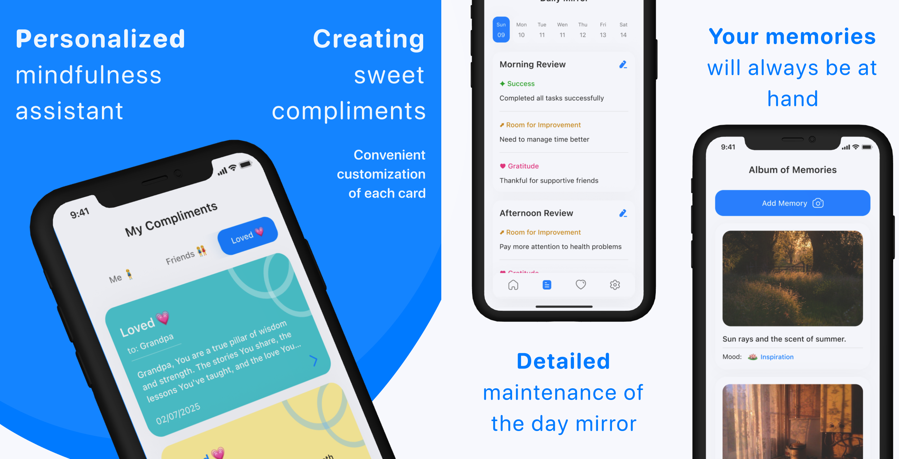
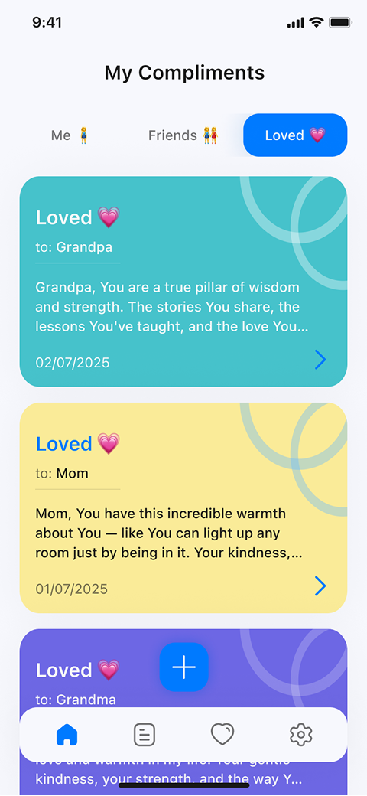
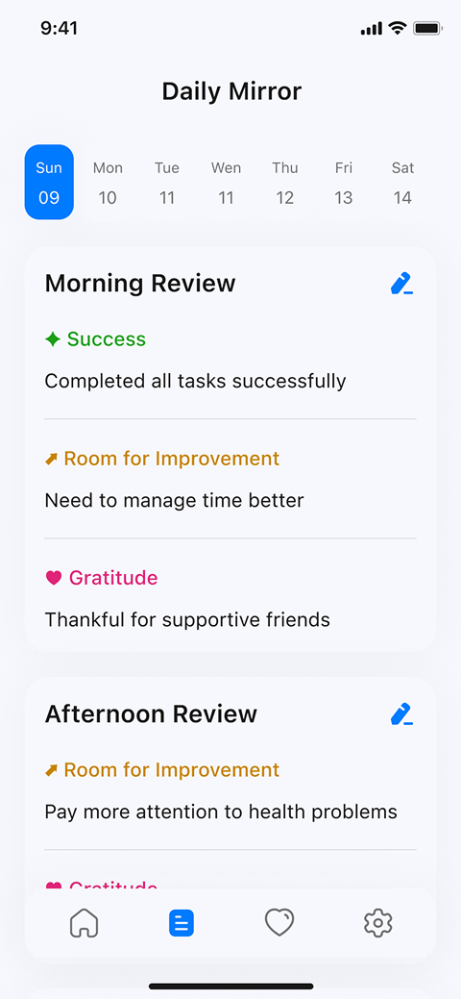
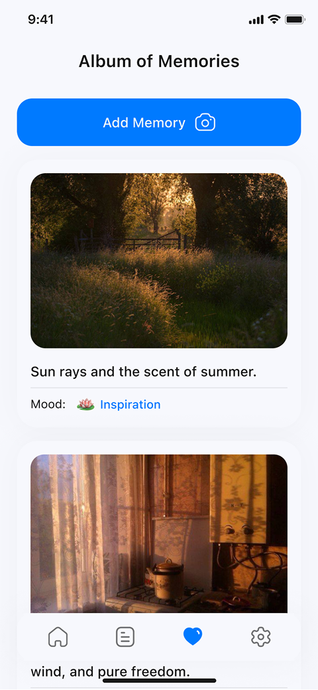

# Echo: Compliments, Memories & Self-Reflection

**Echo** is a Flutter app for practicing gratitude, reflecting on your day, and cherishing memories. Write compliments to loved ones, track your personal growth with daily reflections, and store emotional moments in a visual album.



## 🛠️ Technologies

- **Flutter** and **Dart**
- **Provider** — state management
- **Hive** — local data storage
- **Flutter ScreenUtil** — responsive layout
- **Custom components** — mood tagging, card-based UI, story timeline
- **Local assets** — icons, illustrations, backgrounds

## 📱 Screenshots

| Compliments | Daily Mirror | Album of Memories |
|-------------|---------------|-------------------|
|  |  |  |

## 🚀 How to Run

1. Clone the repo
   ```sh
   git clone https://github.com/NMMustafina/echo_compliments_memories.git
   ```
2. Install all the packages by typing the following command
   ```sh
   flutter pub get
   ```
3. Run the App
